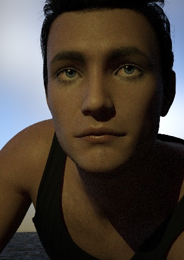

# Chapter Four

Meanwhile, far south, in the most south city, in the southern part of the kings castle, itself in the cities south, an heir to the throne, the crown prince himself, was looking out northwards. 

He had the life of a prince. However, if he knew where Tom was, or even who Tom was, he would have been jealous of her life tonight. 

No more was he a prince in his mind. To him, being an heir to the throne was like being a caged creature: trapped because of his specific bloodline. But soon he would be free.

For a long time he had been preparing himself a new identity: the appearance and paraphernalia to pass as one of the kings many knights. The most difficult item to aquire: a genuine 'knights ring'. It was also the most necessary piece.

He looked out of the northwards arrow slit to see the dusk lit city. The stone walls of the south tower were deeply cold. His pack was ready, he was in the formal knight's robes, with standard knight armour. He had his 'letter from The Prince' safe in his pouch: his disguise complete. 

Putting on the heavy visor, it's weight a strange comfort; it would be as good a disguise as it was heavy. The sound of his breath amplified, his vision cropped.

The south stair would be deserted at this time; his passage unobserved. Sure enough, despite the noise from his pack and him, his exit through the south tower stairs went unheard.

And then following the spiralling stairs into the tunnels, below the keep. Each step through the arches brought a sharp remembrance: what he was walking away from; the responsibility, the throne and the honour of his lineage. 

There it was: the shame on his shoulders.

But a flash of what laid ahead: the open road, a life of freedom, hide away from the chains of state, from historical consequences. Instead be alive day to day; each morning a new life. Each morning free again.

And before his foot hit the floor, an awareness from guilt, that he was born to the crown; beholden to the court. The court that needs a figure at the top to complete the balance of control and function.

But why have an educated king? It makes the crown so much more crueller for the wearer; no personal judgement permitted, beholden to hundreds of years of history. Risk of uprising, or worse.

Another step: his escape effecting his (already sick) father. His younger sister left to inherit the burden; unprepared, multiple effects falling onto her... a royal crown the heaviest.

So he took more steps, faster steps. But hurrying did not abate the remorse. Regret pushed against guilt to a blur. And a new flash of regret: not preparing a torch for this tunnel escape. He had packed a bundle of torches (he had packed everything useful he could think of).

“I could stop and get the torches out...” he thought, mentally navigating through the layers of compacted equipment. He knew the location of everything in his backpack, each item crammed to it's smallest possible bundle. 

He would have to take his helmet off to do that. He might be out of the tunnel soon.

More steps forward but misplacing his footing caused him to temper his speed, calming to a slower pace. 

Slow awkward steps and a draft of air. The tunnel must conclude soon. “Am I doing the right thing?”; he felt anxious. He stopped. The weight of his pack, the weight of his helmet but mostly the weight of his choice.

His stomach churned.

The breeze stronger, the cold biting his eyes. And the sound of rushing. It was the sound of rain. Listening. Somehow the prospect of rain was exhilarating; there was no rain in the life of an heir to the throne. Yet here he was, a few steps away.

The tunnel narrowed and led round to the left. Following this: the smell of rain and the outside. The tunnel became a narrow cave and an opening overlooking fields. Looking out recalling what he had read, what he had studied, and all his preparations: the points of safety on the long routes north: isolated villages and towns, trade points and knight's barracks.

But it was rather dangerous out there, which added to the exhilaration. He had studied (and sometimes personally investigated) the range of possible dangers: bandits were prevalent northwards on isolated trails, a criminal network is growing and has become more bold. Aside from this there are always desperate people. 

While preparing his escape he had noticed that there were a few towns and cities in the south that had their own particular problems... tax collecting was difficult, possibly some organised crime. Typically it was the north that had these problems.

However, a knight would have little problem passing through civilised dwellings; it was the perfect disguise. As for bandits on the trails... he might be able to take them on and defeat them. But the best solution was to travel with a group; strength in numbers. Again the disguise as a knight would be beneficial.

He could cross the rain into his new life, there it was: right there: all that he had prepared for.

A deep sigh, and he felt the peek of his remorse: the prospect of the constricting life behind him, the escape to freedom in front. The sound of the rain neither diminishing or increasing; it was a flat boring constant he found himself aching for.

He stepped forward, the rain ringing each hit on his helmet. Footing difficult in the wet mud, which made progress almost humorously slow. His wet robe becoming heavier. A field's fence a major obstacle. And so his first steps went, travelling near blind; reluctant to take his visor off. Fields seeming to go on forever, the dark night never ending. 

Until morning broke and the rain stopped. For the first time he dared to look back: the castle far in the distance, but not that far... far enough.

He had calculated that first light was the time people would realise he was missing. Now with the sun he could find north, latch onto a suitable trail and follow this as far north as possible: right up to the Expansive Forest perhaps.

In the north, for Tom, The Tailor and Kim the weather was dry. There had been no rain that night. Tom woke later than usual; it was already light. Groggy and disorientated she thought she was at home untill the sleep dusted off. It was with some relief she remembered she was at the village; the sense of liberation was a surprise. This was the first time she recognised the burden of life at home.

Still groggy she pulled her calves taught; stretching her feet to a point. Arms arching back, the stretch bringing a wave of lucidity. She looked at the dust darting through the sumbeams which entered through each knot hole. She had nothing to worry about, no concern. There was no need to hide; she was free.

But there was something wrong. Kim and the cow had gone. She instantly knew what this meant: he was telling her to go. Her feeling of comfort dislodged. She sat up to reassess. The Tailor was still asleep. Kim and the cow had still gone.

Getting up quietly Tom took a few careful steps towards the door, pushing it open; enough to peek outside. There was no trace of her brother. Pushing the doors more she stepped outside looking in the direction of the north trail. Kim and the cow were long gone, no trace of either.

Tom stood looking northwards, imagining how far Kim had gotten. The cow was slow; he would be close. She could catch him up, it would be easy. 

But she could not take a step; blocked by an elusive, buried reason. Wherever he was Kim was walking away slowly. Again, she thought she could catch up with him.

Kim was telling her something though. He had travelled without her for a reason. The elusive reason gaining painful clarity: home was danger.

The hay inside had lost it's bliss, but it felt like the closest thing she had to a home right now, so she went inside.

The Tailor was sitting up looking at her. His face and eyes showing sympathetic sombracity. “Could I live here?” she thought to herself. However, would The Tailor live here? “Where are you going?” she asked him.

He thought about this but rebuffed it laying back: “That's a rather deep question for the morning. How about some breakfast first? Then we can philosophise later.”; Tom deduced she was welcome to be with The Tailor for the foreseeable future, which was breakfast.

“”

