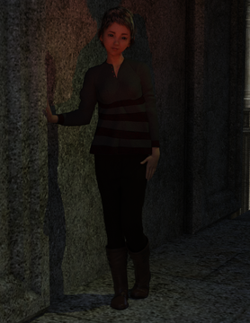

# Chapter Four

Meanwhile, far south, in the most south city, in the southern part of the kings castle, itself in the cities south, an heir to the throne, the crown prince himself, was looking out northwards.

He had the life of a prince. However, if he knew where Tom was, or even who Tom was, he would have been jealous of her life tonight.

No more was he a prince in his mind. To him, being an heir to the throne was like being a caged creature: trapped because of his specific bloodline. But soon he would be free.

For a long time he had been preparing himself a new identity: the appearance and paraphernalia to pass as one of the kings many knights. The most difficult item to acquire: a genuine 'knights ring'. It was also the most necessary piece.

He looked out northwards: the dusk lit city below the castle battlements. It was time, so he went inside. The stone walls of the south tower were deeply cold.

His pack was ready: his formal knight's robe, his standard knight's armour; laid out in neat pieces. He had the 'letter from The Prince' he had written as part of his cover. It was safe in his pouch. His disguise complete.

Knights armour had slightly different strapping compared to the princely armour he was familiar with. But he had prepared and practised, and was soon encased in his new metal shell. Dressed in the overrobe, with his pack on his back, he was almost ready.

The heavy helmet and visor the last parts. These amplified his own breath, and cropped his vision. The discomfort a reassurance; it would be a good disguise.

The south stair was deserted as expected, his rattling armour unheard. Following the spiralling stairs down to the arched tunnels below the keep.

Each step through the arches brought a sharp remembrance: what he was walking away from; the responsibility, the throne and the honour of his lineage. There it was: the shame on his shoulders.

But a flash of what laid ahead: the open road, a life of freedom, hide away from the chains of state, from historical consequences. Instead be alive day to day; each morning a new life. Each morning free again.

So he took more steps, faster steps. But hurrying did not abate the remorse. Regret pushed against guilt to a blur. And a new flash of regret: not preparing a torch for this tunnel escape. He had packed a bundle of torches (he had packed everything useful he could think of).

“I could stop and get the torches out...” he thought, mentally navigating through the layers of compacted equipment. He knew the location of everything in his backpack, each item crammed to it's smallest possible bundle.

He would have to take his helmet off to do that. He might be out of the tunnel soon.

More steps forward but misplacing his footing and almost stumbling caused him to slow down.

Slow awkward steps and a draft of air. The tunnel must conclude soon. “Am I doing the right thing?”; he felt anxious. He stopped. The weight of his pack, the weight of his helmet but mostly the weight of his choice.

His stomach churned.

The breeze stronger, the cold biting his eyes. And the sound of rushing. It was the sound of rain. Listening. Somehow the prospect of rain was exhilarating; there was no rain in the life of an heir to the throne. Yet here he was, a few steps away.

The tunnel narrowed and led round to the left. Following this: the smell of rain and the outside. The tunnel became a narrow cave and an opening overlooking fields.

Looking out of the cave, into the misty rain, his anxiety rose; the prospect of the constricting life behind him, the escape to freedom in front. The sound of the rain neither diminishing or increasing; it was a flat boring constant he found himself aching for.

He stepped forward, the rain ringing each hit on his helmet, deafening him. Footing was difficult in the wet mud, which made progress humorously slow. His wet robe becoming heavier. A field's fence a major obstacle.

And so his first steps went, travelling near blind in the dark; reluctant to take his visor off, even after tripping into a ditch, and climbing out the other side. Fields seeming to go on forever, the night never ending.

Until morning broke and the rain stopped. For the first time he dared to look back: the castle far in the distance, but not that far... far enough.

He had calculated that first light was the time people would begin to realise he was missing. Now with the sun he could find north, latch onto a suitable trail and follow this as far north as possible: right up to the Expansive Forest perhaps.

- - -

In the north, for Tom, The Tailor and Kim the weather was dry. There had been no rain that night. Tom woke later than usual; it was already light. Groggy and disorientated she feared she had overslept her family. With great relief she remembered where she was; the sense of liberation was a surprise. This was the first time Tom recognised the burden of life at home.

Still groggy she pulled her calves taught; stretching her feet to a point, arms arching back. The stretch bringing a wave of lucidity.

Dust darted through the sunbeams, they entered through knot holes. Nothing to worry about, no concern. There was no need to hide.

But there was something wrong.

Kim and the cow had gone. She instantly knew what this meant: he was telling her to go.

Her feeling of comfort dislodged. She sat up to reassess. The Tailor was asleep. Kim and the cow were still gone.

Getting up quietly Tom took a few careful steps towards the door, pushing it open; enough to peek outside. There was no trace of her brother.

Pushing the doors more, she stepped outside looking in the direction of the north trail. Kim and the cow were long gone, no trace of either.

Tom stood looking northwards, imagining how far Kim might have gotten. The cow was slow; he would be close. She could catch him up, it would be easy.

But she could not take a step; blocked by an elusive, buried reason. She did not want to become aware of the reason. Wherever he was, Kim was walking away, slowly. Again, she thought she could catch him up.

Kim was telling her something though. He had travelled without her deliberately. The elusive reason gaining painful clarity: home was danger.

The hay inside had lost it's bliss, but it felt like the closest thing she had to a home right now, so she went inside.

The Tailor was sitting up, looking at her. His face and eyes showing sympathy. “Could I live here?” she thought to herself. However, would The Tailor live here? She looked at him. “Would you live here?”, she asked, instantly regretting asking; obvious that he would not. “Where are you going?”, she heard herself ask.

He thought about this but rebuffed it, laying back: “That's a rather deep questions for the morning. How about some breakfast first?”, he stretched and simultaneously added: “We can philosophise later.”

Tom deduced she was welcome to be with The Tailor for the foreseeable future, which was breakfast.

- - -

The Prince was glad to find a trail, being tired of fields, forest and ferns. A biting chill with little sun, at least not since the bright morning.

His clothes and pack soaked through. His muscles ached; he had never walked so far, with such weight. He could not stop yet though. The tall holly hedges obscured a hut which came into view round the corner. A small opening with stables, a wooden shack and a grain silo.

The Prince stood outside the shack. The buildings were maintained to a high standard. A neatly painted door opened and an old man in a leather apron looked at The Prince.

“Greetings.” The Prince declared, as a Knight would.

“Look at you, what a mess.” the old man replied informally. “You'd better come inside.” and left the door open as invitation. The Prince entered. A small room, bare wooden walls with a long trestle bench along the facing wall. The man had gone through another door to his left, which was open. The old man came back with an arm full of a folded robe, rough towels and underclothes.

“Were you chasing a bolted horse all night?” the old man dryly questioned, “through a stinking marsh?”, snorting a laugh. The Prince flinched to respond, thinking fast to adapt his excuse, but the old man cut him off; “No! Don't explain, I don't want to know. If I wanted to know things I wouldn't be stationed on the marsh road.”

After putting the bundle of clothes on the bench, he noticed the open front door which he closed, giving The Prince an accusing glare. Seeing the pathetic soaked knight, the old man shook his head and patted The Prince on the shoulder: “Get yourself dry young man, can't have a knight looking sorry for himself.” and left through the other door, closing it behind him.

The Prince squatted to rest the weight of his pack on the bench. Easing the straps off each shoulder. The release of weight was immense relief. Now only the weight of his plate armour, helmet and the sodden robes, he felt as light as a feather. He sat next to his pack and relaxed.

“People close doors after them.” he thought to himself, cursing quietly, “What else do I need to know?”

He removed his helmet and pulled his gauntlets off. Wrinkled, numb fingers awkwardly tried to unbuckle the straps on his greaves, and then each of the other, numerous, straps, clasps and buckles.

With his armour removed, towel in hand, he was dry. Now he understood the towel was an important piece of equipment. He had not packed any towels.

The new clothes were mostly the same as his previous, since they were all standard knight issue. But the new overrobe had an older variation of the royal insignia; old, from his grandfathers reign. He wondered how many years it had been in storage.

His previous clothes were in a puddle-pile on the floor. He stared at them, thinking they would be cleaned and dried, and then put into storage. His backpack, still soaked, a reluctant burden. He would get used to the weight. With his helmet on, and visor closed, he was almost ready to return to the trail. Just gather some more strength first.

“Are you asleep?”; The Prince awoke to see the close up face of the old man; peering into his visor. “I was.”, he replied, falling back on honesty in his waking daze. The old man walked off laughing. The Prince felt refreshed. “I had better move myself on,” he thought, “Before I fall asleep again.”.

“I will continue on my journey now.” he called out to the old man, standing up, more slowly than intended. As he stood he regained his persona as a knight, readjusting his helmet so it was straight.

“Good.” replied the old man, shouting through the open doorway. “Nothing personal,” he added, poking his head through the doorway, “I like you as much as I like anyone, and I don't like anyone.”, he explained, wiping his hands with a cloth.

“I very much appreciate your assistance.” The Prince said formally, then, looking in the old man's eyes, added: “Thank you.”; his sincerity ruining the formality.

The old man was pleased with this. “Go on, off you go.”, he shooed The Knight out of the main door, “You might be less annoying than most, but you're still annoying.”
