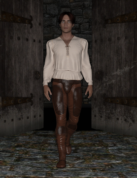

# Chapter Three

Kim held the tether of the cow. Tom waved Jack farewell, who was keen to depart after the transaction. Tom wished Jack had been more social instead of hurrying off. She felt dissatisfied.

Scanning the village, Tom was hoping to be enthused, however the crowds had thinned; the day was coming to a close. She had sold the pips, there was no reason to stay.

“We'd better head back.” suggested Kim.

Tom was not ready for this, she found an excuse: “The trail will be dark. Shouldn't we wait till first light?”

Kim looked at the cow, who was even less keen to hurry than Tom. He sighed, and did not disagree, although Tom could see in his face he had not given up. She looked away, in the other direction there were fewer people around, and someone walking on the path towards them: a handsome, well dressed young man. He wore a bright spotless shirt.

Kim spoke: “Why don't you make your boots go fast?”

The traveller with the spotless shirt heard this, and flashed an awkward glance towards Kim. It was as if her brothers words were slightly shocking. But the traveller looked away, averting an accidental connection with Tom, who was looking in his direction.

As he approached the two he thought: “How odd; a pair of young urchins in rags, one of which has impeccably tailored boots. How is that possible?”

The traveller also wondered why they were holding Jack's cow? He had seen the hasty lad Jack earlier trying to sell it for too much coin; he seemed desperate, but would not change his mind on the high, silly price. “I wonder?” he thought. On all counts nothing about this scruffy pair made sense.

As he got closer, hearing: 'make your boots go fast', he glanced at the two. He could see the one with the boots was a girl not a boy. She wore boys clothes that were too big for her, except for her impeccably fitting boots, which must have been tailored.

The girl noticed his glance, so he looked away, not wanting to intrude. Continuing past them, he put them to the back of his mind, instead concentrating on what might lay ahead.

Using the remaining light, the long road north looked sparse. Also he reckoned it would be bitterly cold, and he heard it was isolated further up. It seemed this place was possibly the last civilised dwelling on the north road.

He stopped. He was sure he could stay at the inn here, at this tiny village tonight.

Behind him the two were arguing; he could hear them: the girl with the boots did not want to get lost in the forest, the boy with the cow wanted to get home. The girl said: “The boots didn't work like that.”, the boy getting a little frustrated. Her final gambit: to plead caution for her own sake, for fear of getting lost again. They stopped talking; the boy apparently swayed.

The well dressed, travelling man turned around. He could see the two strangers with the cow. They had their backs to him, except the cow which looked at him.

He took a few steps forwards. The pair were silent. He stopped short; giving them adequate space. He introduced his presence with a polite cough.They turned around.Bowing slightly, spreading his hands; a gesture of openness.

“Greetings.” he said smiling, more shyly than his snappy clothes and confident posture would suggest.

“Hello!” Tom beamed. Kim stayed silent.
“Could, I... possibly, ask you... endless questions?”: the well dressed man plead with a smile.

Tom laughed; this smart, handsome figure fooling around, it was funny. Even Kim laughed.

“Firstly,” continued the man, “please, allow me to introduce myself: I am a humble travelling tailor.” and he bowed slightly.

“I'm Tom.” she replied, “Do you really want to ask questions? What about?”

The Tailor took a step forward, nodded to confirm, “Yes.” He paused. “Lots. But... first, did you buy that cow off that lad Jack?”

Tom was proud of buying the cow; one of her proudest achievements: “Yes. But why?”

The Tailor looked at Tom, gently stating: “All day Jack was asking a rather high price.”, Tom did not understand. He continued: “I wondered if... would you share how much the cow cost you?”. The Tailor was aware this was a rude question.

Tom shrugged: “Three apple pips.“

The Tailor was confused. Three apple pips?This required more questions: Tom explained they were from a giant apple. She would not share where the apple came from.In fact, she seemed to shut down when asked.

The Tailor would have liked to ask more. He wanted to match her tale of giant apples and strange boots against stories he had heard. But instead of answering questions the girl was talking less, lips sealed.

To lighten the mood, he diverted the conversation to tales of his own travels from the south. This woke Tom up, but not the other one: her brother he presumed.

Tom pressed questions about the south: it's commerce, on cosmopolitan values. Each answer was too much for her to grasp, and yet the questions were numerous. The Tailor answered as best he could, trying to keep up.

Kim interrupted, slightly angry: “It's cold.” Tom and The Tailor stopped talking and silently agreed, yet they could have talked more.

The Tailor had not satisfied his curiosity, there was still too much about the girl that was a mystery. He wanted to stare at her footwear, but resisted.

Tom was equally enthralled by The Tailor. The places he had seen; he seems to have seen the whole world! This man was friendly, easy to talk to. Unlike Jack, The Tailor would listen to what she said. He took an interest in her questions, and was gentle with her misunderstandings. She felt invigorated, like she had seen some of the world.

Tom built a picture in her mind of towns further south: of people and lifestyles, how others lived and the wonders of life outside the forest.

Kim had ignored the two while they were talking. All the time he had been wondering how the town's people choose which building to sleep in. He was expecting to fight for space, but he was not sure how it worked here.

The Tailor did not notice their naivety: “Let’s get to the inn.”, and they followed him, walking slowly.

The Tailor gestured towards the cow: “I doubt she will be allowed inside.”, adding to the cow: “Sorry old girl.” Turning to Tom and Kim, his palms facing them; asking them to wait: “I’ll talk to the innkeeper, see if we can stay in the barn.”

Tom wondered what an innkeeper was. She built an imaginary picture of a large man. He had a solid club and a serious face. She did not want to get the attention of the innkeeper. So she did as The Tailor suggested; stopped and waited. Kim seemed to have reached the same conclusion.

The Tailor opened the door, layers of noise escaped. And the smell of warm food. There was bread and gravy in there. And now aware of an intense hunger, which encouraged a curiosity to peek inside. However, these instincts battled against the image of the innkeeper.

The door opened, this time a waft of gravy with the sound of laughter. The Tailor had returned. “We can stay in the stables tonight,” he reported cheerfully, “it’s this way, follow me.”, and they followed him to around the other side of the inn.

The stable door swung open easily (and surprisingly silently). Inside was a large space offering fresh hay, but no trace of horses. Not a scent.

The Tailor stopped dead in his tracks: “Well...” he exclaimed. “This thorpe might be one of the grottiest hovels I've ever seen, but they do have the finest stables.”

Tom was stunned to silence at the sight of the space, and the luscious piles of hay. Kim claimed one of the close corner sections. Tom laid claim to the equal corner opposite and The Tailor joined her side, both having ample space.

Fumbling at his sides he walked to the centre of the open space, reached up on tiptoes towards something overhead, and pulled a dangling thing down.

Something far above rattled. Movement caught Toms eye, and she saw a rope swinging in and out of the edge of the open door.

“Ah!” shared The Tailor, as if this answered something. Working with his hands, a spark of light illuminated his face. The dangling thing became a lantern. The stables were lit. A soft flickering glow.

Closing a tiny door on the lantern, he tentatively let go; as if it would drop. But it did not. He walked towards the massive open door, watching the lantern the whole time. It swung slightly.

Grasping the rope, which swung by the door, he pulled gently. The lantern lowered slightly. The Tailor laughed in victory, looking towards the rope and taking hold of a second higher rope next to the first.

Pulling the second rope caused the lantern to rise. Then it stopped and The Tailor stared at the dangling lantern. It swung strangely. Tom liked this; how it wibble-wobbled. “Now that is clever.” The Tailor concluded.

Then speaking more to himself than the two sitting down: “The innkeeper said it housed more people than horses. I doubt anyone actually travels *to* this place.”

He looked around again: the agitated lantern animated the shadows. “We have ourselves a stable situation.”, he laughed at his own play on words and continued: “If more people stay here than horses, it explains everything.”

Suddenly The Tailor turned towards the door saying: “I have to settle up with the innkeeper. And get us some food, I'm really hungry.” Then he left.

Tom looked between Kim and the cow. Both were settled and looking ready to sleep. The shadows moved with the lantern but more gently. She thought to get up and give it more swing, but was not sure she could escape the hay.

Time passed and Tom almost drifted off to sleep when The Tailor returned. Carrying three bowls, balanced with grace, and the rich smell of gravy. He handed one bowl to Kim, who sat up quickly surprised. A chunk of bread and a wooden spoon added to the surprise, Kim was unsure what this all meant, or what had just happened.

The Tailor planted the same on Tom, then sat in Tom's adjacent section. He happily spooned the broth. Looking to both Kim and Tom, they were surprised, still holding bread and spoons as when first handed to them. The Tailor finished a mouthful, then pointing with his spoon: “It's better than it looks, I promise.”

Tom and Kim took their cue and started eating. It was simply the finest broth Tom had ever tasted, and the freshest bread.

Butter, bread and broth.

“This is the life.”, Tom thought, looking through the open door as she ate. So it was (and not that Tom knew) she was looking southwards. She brought fantasies of The Tailors stories to mind, and embellished them with broth like this.

The south had broth and hay beds fit for princes.
