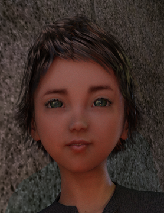

After recovering his breath, Kim moved alongside his sister. He was looking at the village, he was ready for trouble. Her train of thought evaporated.

They walked towards the village at a slow pace, absorbing everything, every sight, sound and smell: dogs, geese, carts and horses, stacks of things by the buildings, sacks of things by the stacks. Smoke and banging. And the people, how they were dressed: everyone had good boots or clogs. Tom gave her own boots a quick look. Pride surged through her with a dawning thought: she was fitting in.

Tom snuck a look at Kim: he looked perturbed, as if the whole thing had been a bad idea. Tom turned to face her brother, inviting him into her excitement. Kim returned her look, but it was clear from his face he was not excited.

Suddenly there was someone behind them: “You two are new.”, the person said. Tom and Kim stopped abruptly and turned: there was a fair haired boy. A bit older than Kim. He was leaning against the wall, holding a cow tethered by a nose ring. “Where you from?”: the boy glanced between Tom and Kim, but settled on Tom.

Kim barely said a thing; a slight grunt of disapproval.

But Tom answered eagerly: “Hello! we’re from The Forest.” pointing north to explain.

“Oh.” said the boy, as if he was interested. “The Forest.” he nodded agreeing but did not continue. An expectant pause brewed.

“What you come down here for then?” he asked.

Kim looked to Tom. 

She realised this was it, her chance: “I’ve come to sell apple pips.”

There was another pause, but this one dropped.

“Oh.” said the boy after some thought, almost masking his doubt.

Tom produced one of the giant pips, holding it in her outstretched palms: “Look!”

The boy saw her offering and after almost no time, he was astonished. Which was accompanied by silence.

“That’s not right.” he observed, slowly, then looking at Tom: “Who else you shown it to?”

“No one, you’re the first.” came Tom’s quick reply.

“Where’d you get that from then?” the boy asked, adding: “I’m Jack by the way.”

“Nice to meet you Jack, I'm Tom. We got it from a giant apple.”

Jack did not seem to notice her greeting which was her favourite part. Instead he asked: “What you planning on doing with it?”

Tom was sure she had answered this already. “We came from The Forest to sell it.”

“Oh.” said Jack. “What for?”, quickly clarifying, “How much you asking for it?”

Kim interrupted, demanding: “A cow.”

Jack challenged a question back: “A cow?” He was incredulous, barely containing chortles.

“Come on.” said Kim to Tom, grabbing her quickly as he turned to leave.

“No!” burst Jack, “Wait!”; his interest in the pip confirmed.

Kim stopped but kept his grip on Tom, her jumper stretching as she turned to Jack: “I’ve got three.”

“Oh!” exclaimed Jack, as if this changed everything, “Three! why didn’t you say so?”

Kim was not convinced. Without hesitation he turned away, pulling Tom with him.

“Alright, alright. The cow for the pips,” Jack negotiated, “but only for *all* of them.”
